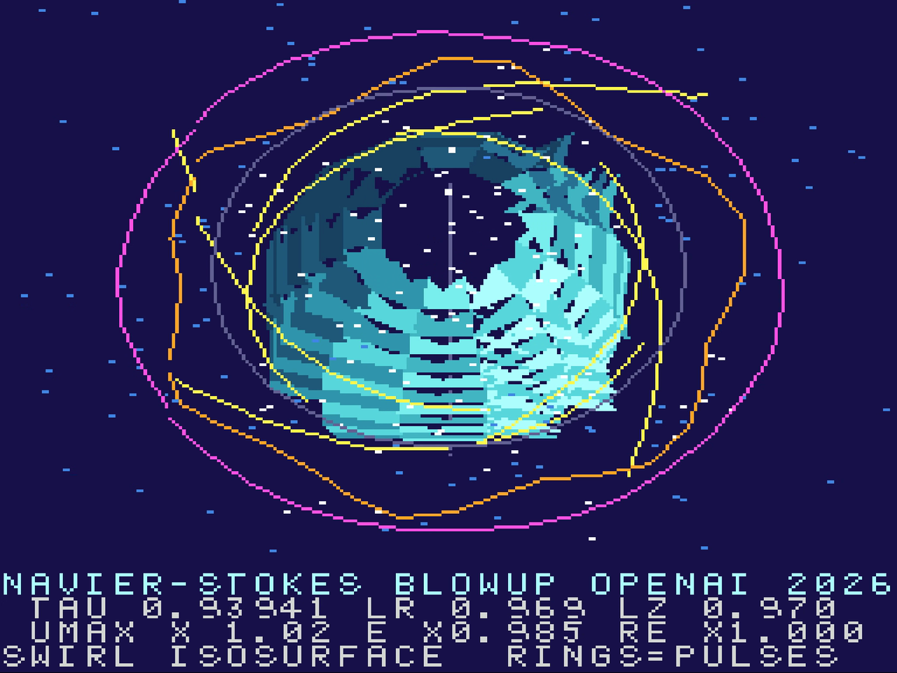

# Navier–Stokes finite-time blowup, rendered on a Super Nintendo's Super FX 2

OpenAI's September 2026 result says the forced 3D Navier–Stokes equations can
blow up in finite time: a vortex core that tightens and spins up while the
energy stays bounded. This repo renders that construction, in the paper's own
similarity variables, on the SNES's "3D chip" — the Super FX 2 (GSU-2) that
powered Star Fox — as a filled, shaded, perspective 3D scene at 256x192.

**Play it in your browser:** https://keithadler.github.io/superfx-navier-stokes/
(EmulatorJS + snes9x; `?rom=cube` shows the cart spec screen).



Everything here was written from scratch in a day: the 65816 SNES side, a
tiny Super FX assembler in Python, the GSU renderer (filled triangles,
back-face culling, perspective, particles, streamlines), the model and its
fixed-point tables, and the cartridge layout (2 MB ROM, 128 KB RAM, GSU-2).

What is faithful to the paper and what is not: the similarity scalings
(radial √τ, axial τ^(1/2−h)), the exponents on the readouts (|u| ~ τ^(−1/2−h),
core energy ~ τ^(1/2−3h), Re_θ ~ τ^(−h)), the inward spiral with axial outflow
split near z = 0, swirl vanishing on the axis, and the annulus pulse layers
that grow on the shear then decay are all from the paper. The profile
functions themselves are solved numerically in the paper, so this uses
closed-form stand-ins with the same axis and far-field behaviour, and the
amplitudes are chosen for visibility. Time runs in log steps because the
dynamics are self-similar.

---

## Workbench notes

SNES homebrew workbench for a **Super FX 2 (GSU-2) cartridge with 2 MB ROM and
128 KB cartridge RAM**. 65816 code is built with cc65's `ca65`/`ld65`, the GSU
program with the tiny assembler in `tools/gsuasm.py`, and the ROM runs in the
browser with EmulatorJS (snes9x core).

## Build and run

```
make            # build/superfx.sfc (2 MB), copied to web/rom.sfc
make serve      # http://127.0.0.1:8794  (or the Claude Code launch entry "snes")
```

Reload the page (or click **Reload ROM**) after each `make`.

## Demos

- `make` (or `make DEMO=ns`) – **Navier–Stokes finite-time blowup** (OpenAI,
  Sept 2026) rendered Star Fox style: a 256x192 16-colour Super FX framebuffer,
  double buffered in the 128 KB cart RAM, sent to VRAM in five VBlank chunks
  (12 fps). Per frame the GSU draws the swirl iso-surface as ~170 filled,
  flat-shaded, back-face-culled triangles with helical spin stripes, six
  spiral streamlines, 256 advected particles, the two pulse families in the
  annulus, the axis and the core circle, all through a perspective projection
  with an orbiting camera. The SNES prints τ, ℓr, ℓz, |u|max, energy and Re_θ
  scaled by the paper's exponents. Model and tables: `tools/nsmodel.py`
  (`python3 tools/nsmodel.py preview.png` renders a reference sheet). GSU:
  `src/ns.gsu`, SNES: `src/ns.s`. The exponents/scalings are the paper's; the
  profile shapes E, U, V0 and the iso-surface are closed-form stand-ins with the
  same axis/far-field behaviour.
- `make DEMO=cube` – the spec screen + GSU wireframe cube described below.
- `make DEMO=game` – PAPER GRAB, a parked side-scroller experiment (NS demo as
  the PRESS START title, then an AI billionaire punching nerds for their papers).
  Cancelled 2026-09-09 mid-balance; it runs but is unfinished. Sources:
  `src/game.s`, `tools/sprites.py`, `tools/bgmap.py`.

## What the cube ROM does

- Probes the hardware and prints the cart/display specs on BG3: CPU, GSU
  version register, ROM size and bank count from the header, declared cart
  RAM plus a read/write test of every declared 64 KB bank, NTSC/PAL, PPU
  versions, and a frame counter incremented by the GSU itself.
- Runs `src/cube.gsu` on the Super FX every other frame: clears a 128x128
  16-colour framebuffer in cart RAM, rotates a cube (sin table, `fmult`),
  projects it with a reciprocal table, draws the 12 edges with Bresenham
  `plot`, then `stop`s. The SNES DMAs the 8 KB framebuffer to VRAM in two
  VBlank halves (30 fps).

## Layout

- `src/main.s` – SNES side: init, spec screen, GSU control, DMA loop, header.
- `src/cube.gsu` – Super FX program (see comments for the RAM map).
- `src/font.inc` – 128 2bpp tiles, tile number = ASCII code (`tools/mkfont.py`).
- `src/tables.inc` – sin/reciprocal tables and cube model (`tools/gentables.py`).
- `tools/gsuasm.py` – GSU assembler: `.org`, labels, `NAME = expr`, `.db/.dw`,
  all opcodes incl. `move`/`moves`, repeat counts (`asr 6`); emits `build/<x>.bin` + `.inc`.
- `lorom.cfg` – 64 x 32 KB LoROM banks; `GSUCODE` in bank 1 (`$01:8000`, PBR=1),
  `RAMCODE` load/run split for the WRAM routine, header at `$FFB0`.
- `tools/fixsum.py` – patches the internal-header checksum.
- `web/index.html` – EmulatorJS page (core files from cdn.emulatorjs.org).

## Memory maps

VRAM (words): `$0000` BG3 text map, `$0400` BG1 cube map, `$1000` font,
`$2000` framebuffer tiles (tile 256 = blank).

Cart RAM bank `$70` (NS demo): `$0000` and `$6000` the two 24 KB framebuffers
(32 columns x 768 bytes, column-major 4bpp tiles), `$C000` tables (sin, advection,
Ω, pulse envelope, perspective and slope reciprocals, shade, tube rings),
`$D300` per-frame parameters, `$D400` 256 particles, `$DA00` pulse slots,
`$DB00` projected tube vertices, `$DE00` scratch. VRAM: `$0400` BG1 map
(32x24 column-major tiles + blank tile 768), `$2000..$4FFF` framebuffer tiles.

## Super FX rules baked in

- The GSU runs from ROM with `SCMR` RON+RAN set, so the SNES code that starts
  it and waits for the G flag lives in WRAM (`gsu_run`, segment `RAMCODE`).
  NMI stays off; VBlank is polled via `HVBJOY`.
- Branches, `jmp`, `loop` have a delay slot; `link #2` must sit right before
  the `jmp` (return = jmp + 2).
- `plot` increments R1; the line routine `dec r1` after each plot.
- `ibt` sign-extends, `add/sub/and/or #n` take 0..15 only, `iwt` for the rest.
- `and r0` is MERGE (use another register for masks); `lm`, `from`, `to`, `ibt`
  set no flags, so `add #0` before a conditional branch on a loaded value.
- Branch range is ±128 bytes; long loops go `beq skip / iwt r13,#top / jmp r13`.
- Q7 for screen-space edge accumulators (x up to 255 << 8 overflows a signed
  word); Q10 for per-frame scales above 16 px/unit. Doubling chains (`add r0`)
  need SREG = r0, i.e. `move r0,rX` first, not `from rX`.
- A pointer saved mid-record and then advanced by the record size drifts; save
  the record base. Signed compares treat $FFFF as -1 (inactive markers).
- VBlank budget: ~6 KB of DMA is the whole NTSC VBlank; ~4.9 KB + 30 text
  characters fits. snes9x blocks VRAM writes outside VBlank like hardware.
- 65816: `txa`/`tax`, `tya`/`tay` with 8-bit A and 16-bit X/Y drag the hidden
  high accumulator byte into the index (loops never end, stray writes) — do
  index arithmetic under `rep #$20`; never `ldx`/`ldy` an 8-bit variable;
  a 16-bit `sbc py` reads the next byte too. `php` is an opcode, not a name.
- EmulatorJS keyboard input: libretro ids 0=B(X key) 1=Y(S) 3=Start(Enter);
  in the Claude browser pane synthetic keys do not reach it, so drive tests
  with `EJS_emulator.gameManager.simulateInput(0, id, 1/0)` from JS.

## Gotchas

- ca65 2.18: `.charmap` cannot map to code 0 (hence the ASCII font); a local
  label named `s` collides with the S register; `&` binds tighter than `+`
  (use `.loword()`/`.bankbyte()` in macros); includes resolve relative to the
  source file (`-I build`); a named label ends the cheap-label (`@`) scope.
- 8/16-bit: `tax` with 16-bit X copies the hidden high byte; mask first.
- snes9x maps more cart RAM banks than a real GSU-2 has; the test only touches
  what the header declares. snes9x returns `VCR = $00` (hardware says `$04`).
